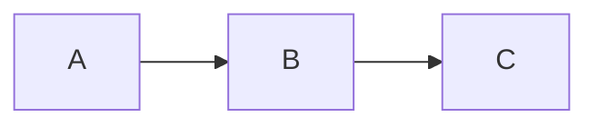

# MDExMermex

[](https://hex.pm/packages/mdex_mermex)
[](https://hexdocs.pm/mdex_mermex)
[](LICENSE)

An [MDEx](https://hexdocs.pm/mdex) plugin that renders Mermaid diagrams server-side using [Mermex](https://hexdocs.pm/mermex) (Rust NIF). Each diagram is wrapped in an interactive container with zoom, pan, and fullscreen controls.

## Installation

Add `mdex_mermex` to your list of dependencies in `mix.exs`:

```elixir
def deps do
  [
    {:mdex_mermex, "~> 0.1.0"}
  ]
end
```

Then run:

```sh
mix deps.get
```

## Usage

Pass `MDExMermex` as a plugin to `MDEx.to_html!/2`:

````elixir
markdown = """

"""

MDEx.to_html!(markdown, plugins: [MDExMermex])
````

This renders the Mermaid diagram server-side and outputs an interactive HTML container with the SVG inline. CSS and JS are injected once per document by default.

## Options

| Option        | Default       | Description                                                     |
| ------------- | ------------- | --------------------------------------------------------------- |
| `:output`     | `:inline_svg` | `:inline_svg` for raw SVG, `:img_base64` for base64 `` tag |
| `:class`      | `nil`         | Additional CSS class(es) appended to the wrapper `<div>`        |
| `:inject_css` | `true`        | Set to `false` to skip per-document `<style>` injection         |
| `:inject_js`  | `true`        | Set to `false` to skip per-document `<script>` injection        |
| `:css_layer`  | `nil`         | Wraps injected CSS in a `@layer` rule (e.g. `"components"`)     |

```elixir
# Base64 image output
MDEx.to_html!(markdown, plugins: [{MDExMermex, output: :img_base64}])

# Custom CSS class — produces: <div class="mdex-mermex my-diagram" tabindex="0">
MDEx.to_html!(markdown, plugins: [{MDExMermex, class: "my-diagram"}])

# Wrap injected CSS in a cascade layer
MDEx.to_html!(markdown, plugins: [{MDExMermex, css_layer: "components"}])
```

## Including Assets Manually

When injection is disabled (e.g. for Phoenix LiveView where inline `<script>` tags won't execute via DOM patches), import the assets directly from the package:

- **CSS** — `assets/mdex_mermex.css`
- **JS** — `assets/mdex_mermex.js`

```elixir
MDEx.to_html!(markdown, plugins: [{MDExMermex, inject_css: false, inject_js: false}])
```

The JS uses a `MutationObserver` to automatically initialize diagrams added to the DOM after page load, making it compatible with LiveView and other frameworks that patch the DOM.

## Features

- **Server-side rendering** — Mermaid diagrams are rendered at compile/build time via a Rust NIF, no client-side JavaScript Mermaid library needed
- **Zoom & pan** — scroll to zoom toward cursor, click-and-drag to pan, double-click to reset
- **Toolbar** — hover to reveal zoom in/out, reset, and fullscreen buttons
- **Fullscreen** — expand any diagram to fill the screen via the Fullscreen API
- **LiveView compatible** — `MutationObserver` initializes diagrams on DOM patches; `data-mdex-init` prevents double binding
- **Flexible asset injection** — CSS and JS injected per-document by default, or import manually from the package's `assets/` directory

## License

MIT — see [LICENSE](LICENSE) for details.
